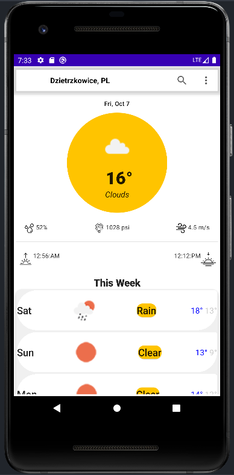
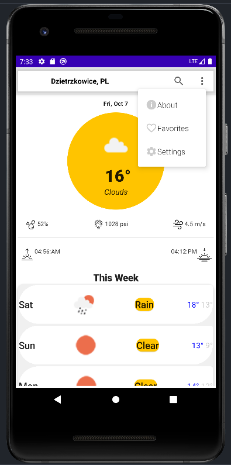
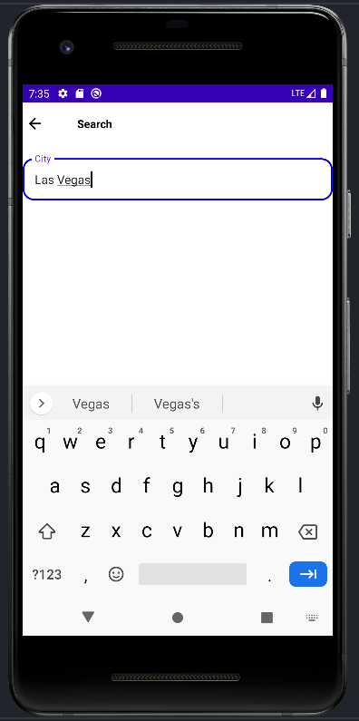
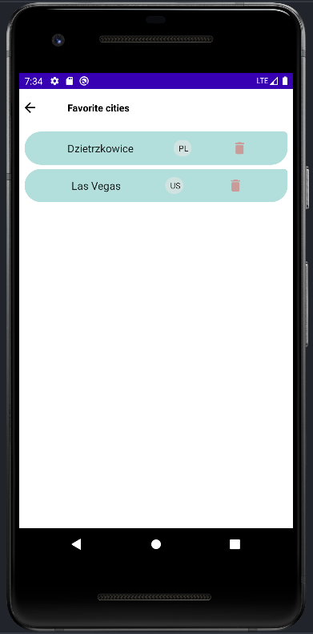
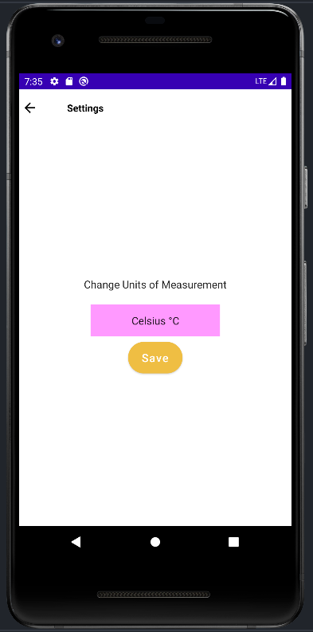

# JetWeatherForecast
Android application with weather forecast for the selected location, made with Udemy course. Application enable saving favorite cities and switching from metric to imperial units.

### Tools and technologies
* MVVM
* Retrofit
* Coil
* Room
* DI - dagger hilt

###### API - https://openweathermap.org
